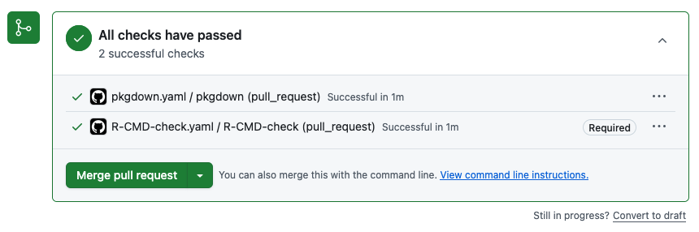

# R Package Development with Positron

This vignette demonstrates the core elements of building an R package,
suitable for a ~2 hour workshop. The accompanying workshop will
demonstrate building an R package using Positron IDE.

## Setup

### Positron

To follow along during the live workshop, you’ll need to do a few things
to get set up.

First, you’ll need to install [R](https://www.r-project.org/) and
[Positron](https://positron.posit.co/).

To follow along the full tutorial you’ll need the following packages
installed:

``` r
install.packages(c(
  "usethis",
  "devtools",
  "roxygen2",
  "testthat",
  "knitr",
  "rmarkdown",
  "pkgdown",
  "available",
  "dplyr",
  "janitor",
  "readxl",
  "stringr",
  "covr",
  "DT",
  "htmltools",
  "here"
))
```

### Git and GitHub

You’ll also want to make sure git is installed on your system, and that
you have a GitHub account set up. I also recommend setting up an SSH key
(<https://github.com/settings/keys>) for pushing code to GitHub.

### Air

Optional, but recommended: I like to set up
[Air](https://posit-dev.github.io/air/), an R formatter for R written in
Rust. This automatically formats your code whenever you save, fixing
indentation and spacing issues. Then open up your `settings.json` file
from the Command Palette (`Cmd+P`on Mac/Linux, `Ctrl+P` on Windows),
then run `Preferences: Open User Settings (JSON)` to modify workspace
specific settings, and add this to format on save:

``` json
{
    "[r]": {
        "editor.formatOnSave": true,
        "editor.defaultFormatter": "Posit.air-vscode"
    },
    "[quarto]": {
        "editor.formatOnSave": true,
        "editor.defaultFormatter": "quarto.quarto"
    }
}
```

### RStudio keybindings

Optional, but strongly recommended: I like to use the RStudio keyboard
shortcuts so I get things like Cmd+Shift+E to run a package check,
Cmd+Shift+D to document, Cmd+Shift+B to build. In those user settings:

``` json
{
    "workbench.keybindings.rstudioKeybindings": true
}
```

## R packages

R packages are collections of functions, data, and documentation that
are bundled together in a standardized structure so they can be
installed, shared, and reused.

Writing your own package forces you to organize your code, write
documentation, and include examples that make your work easier to
understand and reuse later. Packages make your functions portable,
installable with a single command, and versioned, which makes it much
easier to collaborate and to know exactly what code produced a given
result. Over time, maintaining and extending a package is far easier
than managing a pile of ad hoc scripts.

The basic development cycle for a package is a tight loop. You edit
code, try it in the console using the development version of your
package, write or update documentation, and then build and run
`devtools::check()` to catch errors, warnings, and notes before you
continue developing or share. You repeat this loop as you add new
functionality, tests, data, and examples.


In this tutorial we will make heavy use of the usethis package. usethis
provides helper functions that automate many of the repetitive tasks in
package development, such as creating the package skeleton, adding new
functions, setting up tests, configuring Git and GitHub, and enabling
pkgdown and continuous integration. By using usethis, you can focus on
writing good epidemiology and public health code while letting the
tooling handle most of the boilerplate.

## Creating our package

Let’s create our package! But before we do, it’s useful to check if
there are any conflicts with existing packages with the same name, and
it’ll also check Wikipedia, Wiktionary, and run some simple sentiment
analysis to make sure your package name is appropriate.

``` r
available::available("rpkgdemo")
```

I like to use positron to start a new start a new folder, and in that
folder create the package with `usethis::create_package()`. So create a
new folder somewhere on your system called `rpkgdemo`, open that folder
in Positron, and then run the following to create the package:

``` r
usethis::create_package(".")
```

Now there are a few one-time things we need to do here before we go any
further.

### License

First, let’s run a `R CMD check` to see if there are any issues with our
package skeleton. Run `devtools::check()` at the console, or
cmd+shift+E, or command pallette cmd+shift+P “R: Check R Package”.

    W  checking DESCRIPTION meta-information ...
       Non-standard license specification:
         `use_mit_license()`, `use_gpl3_license()` or friends to pick a
         license

Right away we see that there’s an issue with the placeholder created by
`usethis::create_package()`. We need to add a proper license. Let’s go
ahead and add an MIT license with:

``` r
usethis::use_mit_license()
```

Edit the `LICENSE` file to add your name.

Run the check again.

    ── R CMD check results ── rpkgdemo 0.0.0.9000 ──
    Duration: 6.2s

    0 errors ✔ | 0 warnings ✔ | 0 notes ✔

### Git

Now let’s initialize a git repository for our package, and a
corresponding repo on GitHub. You can do this with the Positron Source
Control pane, or at the console:

``` sh
git init
git add .
git commit -m "Initial commit"
git remote add origin <your-repo-url>
git push -u origin main
```

Open up the command pallette and run `Developer: Reload window`.

And take note of your GitHub repo URL. We’ll need it shortly.

A note about `.gitignore`: You can create one yourself, or use
`usethis::git_vaccinate()`, which adds `.Rproj.user`, `.Rhistory`,
`.Rdata`, `.httr-oauth`, `.DS_Store`, and `.quarto` to your global
(a.k.a. user-level) `.gitignore`. This is good practice as it decreases
the chance that you will accidentally leak credentials to GitHub.
git_vaccinate() also tries to detect and fix the situation where you
have a global gitignore file, but it’s missing from your global Git
config.

### The `DESCRIPTION` file

The `DESCRIPTION` file is the metadata for your package. It contains
information about the package name, version, author, description,
license, and dependencies. Let’s go ahead and edit this file to add some
more information about our package.

This is what it looks like out of the box:

    Package: rpkgdemo
    Title: What the Package Does (One Line, Title Case)
    Version: 0.0.0.9000
    Authors@R: 
        person("First", "Last", , "first.last@example.com", role = c("aut", "cre"))
    Description: What the package does (one paragraph).
    License: MIT + file LICENSE
    Encoding: UTF-8
    Roxygen: list(markdown = TRUE)
    RoxygenNote: 7.3.3

Let’s edit it to look like this (put in your own name, email, package
name, etc). Put in the URL of your GitHub repo in the URL field. Go
ahead and put in the GitHub pages URL (which we haven’t created yet but
will later). If your repo url is github.com/username/package, the GitHub
pages URL will be username.github.io/package.

    Package: rpkgdemo
    Title: A demo package for building R packages
    Version: 0.0.0.9000
    Authors@R: 
        person("Stephen", "Turner", , "first.last@example.com", role = c("aut", "cre"),
               comment = c(ORCID = "0000-0001-9140-9028"))
    Description: A package to demonstrate building an R package to accompany a
        workshop on building R packages in Positron. See the getting started
        vignette for details.
    License: MIT + file LICENSE
    URL: https://github.com/stephenturner/rpkgdemo, https://stephenturner.github.io/rpkgdemo/
    BugReports: https://github.com/stephenturner/rpkgdemo/issues

## Functions, part 1

The fundamental building blocks of R packages are functions. Let’s add
some functions to our package.

### Our first function: no external dependencies

Let’s add a simple function that doesn’t use any external dependencies.
This function will suppress data counts below a specified threshold by
replacing them with `NA`. This might be required in some public health
setting to protect privacy when reporting small counts.

All functions need to be in the `R/` directory of the package. These are
regular `.R` files. You can organize your functions in any way you like
within this directory. I like to group related functions together in the
same file. Let’s create a file called `utils.R` to hold our utility
functions.

You could just create a new file manually, but I like to use the
`usethis::use_r()` function, because it pairs well with
`usethis::use_test()` that we’ll discuss later. For example, to create a
file named `utils.R`, you would run:

``` r
usethis::use_r("utils")
```

Now let’s add our function to this file.

``` r
suppress_counts <- function(x, threshold = 5) {
  # Check if input is numeric
  if (!is.numeric(x)) {
    stop("Input x must be numeric.")
  }

  # Suppress counts below the threshold
  x[x < threshold] <- NA

  # Return the modified vector
  return(x)
}
```

We can try this function out in the console:

``` r
suppress_counts(c(1, 3, 5, 7, 9))
#> [1] NA NA  5  7  9
suppress_counts(c(10, 20, 3, 4, 5), threshold = 10)
#> [1] 10 20 NA NA NA
suppress_counts(c("a", "b", "c"))
#> Error in suppress_counts(c("a", "b", "c")): Input x must be numeric.
```

Now we need to document our function using special “roxygen comments” so
that we can get help on our function with
[`?suppress_counts`](https://stephenturner.github.io/rpkgdemo/reference/suppress_counts.md).
You can learn more about roxygen2 syntax
[here](https://r-pkgs.org/man.html).

The easiest way to do this is with the Positron Code Action to generate
a roxygen skeleton. Place your cursor on the function name and invoke
the Code Action by clicking the 💡.


This will result in something that looks like this:

``` r
#' Title
#'
#' @param x
#' @param threshold
#'
#' @returns
#'
#' @export
#' @examples
suppress_counts <- function(x, threshold = 5) {
  # Check if input is numeric
  if (!is.numeric(x)) {
    stop("Input x must be numeric.")
  }

  # Suppress counts below the threshold
  x[x < threshold] <- NA

  # Return the modified vector
  return(x)
}
```

Before we can use the function, we need to generate the documentation
files. We can do this with the `devtools::document()` function, which
processes the roxygen comments and creates the necessary files in the
`man/` directory. You can also use the keyboard shortcut cmd+shift+D to
run this command.

You’ll see some errors:

    ✖ utils.R:3: @param requires two parts: an argument name and a description.
    ✖ utils.R:6: @returns requires a value.
    ✖ utils.R:9: @examples requires a value.

Let’s go ahead and fill out our full documentation.

``` r
#' Suppress Low Counts for Privacy
#'
#' Replaces numeric counts below a threshold with a suppression character ("NA").
#'
#' @param x A numeric vector of counts.
#' @param threshold Numeric. Values strictly less than this are suppressed. Default 5.
#'
#' @return A vector.
#' @export
#'
#' @examples
#' suppress_counts(c(1, 3, 5, 7, 9))
#' suppress_counts(c(10, 20, 3, 4, 5), threshold = 10)
#'
suppress_counts <- function(x, threshold = 5) {
  # Check if input is numeric
  if (!is.numeric(x)) {
    stop("Input x must be numeric.")
  }

  # Suppress counts below the threshold
  x[x < threshold] <- NA

  # Return the modified vector
  return(x)
}
```

Document and build the package again. Now try
[`?suppress_counts`](https://stephenturner.github.io/rpkgdemo/reference/suppress_counts.md)
to see the help file.


Go ahead and run a check (cmd+shift+E) to make sure everything is
working so far.

    ── R CMD check results ── rpkgdemo 0.0.0.9000 ──
    Duration: 8.7s

    0 errors ✔ | 0 warnings ✔ | 0 notes ✔

### Adding additional arguments

Now let’s add an additional argument to our function to allow users to
specify a custom suppression value. R is smart enough to automatically
change the type to character if we provide a character suppression
symbol.

``` r
#' Suppress Low Counts for Privacy
#'
#' Replaces numeric counts below a threshold with a suppression character (`NA`).
#'
#' @param x A numeric vector of counts.
#' @param threshold Numeric. Values strictly less than this are suppressed. Default 5.
#'
#' @return A vector.
#' @export
#'
#' @examples
#' suppress_counts(c(1, 3, 5, 7, 9))
#' suppress_counts(c(10, 20, 3, 4, 5), threshold = 10)
#' suppress_counts(1:10, threshold = 5, symbol = "*")
#'
suppress_counts <- function(x, threshold = 5, symbol = NA) {
  # Check if input is numeric
  if (!is.numeric(x)) {
    stop("Input x must be numeric.")
  }

  # Suppress counts below the threshold
  x[x < threshold] <- symbol

  # Return the modified vector
  return(x)
}
```

If you rebuild the package the function will work:

``` r
suppress_counts(1:10, threshold = 5, symbol = "*")
```

But now run a check (cmd+shift+E) and you’ll see a warning:

    ── R CMD check results ── rpkgdemo 0.0.0.9000 ──
    Duration: 9.2s

    ❯ checking Rd \usage sections ... WARNING
      Undocumented arguments in Rd file 'suppress_counts.Rd'
        ‘symbol’
      
      Functions with \usage entries need to have the appropriate \alias
      entries, and all their arguments documented.
      The \usage entries must correspond to syntactically valid R code.
      See chapter ‘Writing R documentation files’ in the ‘Writing R
      Extensions’ manual.

    0 errors ✔ | 1 warning ✖ | 0 notes ✔
    Error: R CMD check found WARNINGs
    Execution halted

So go back and add documentation for the new `symbol` argument.

``` r
#' Suppress Low Counts for Privacy
#'
#' Replaces numeric counts below a threshold with a suppression character (`NA`).
#'
#' @param x A numeric vector of counts.
#' @param threshold Numeric. Values strictly less than this are suppressed. Default 5.
#' @param symbol Character or `NA`. The symbol to use for suppression. Default is `NA`.
#'
#' @return A vector.
#' @export
#'
#' @examples
#' suppress_counts(c(1, 3, 5, 7, 9))
#' suppress_counts(c(10, 20, 3, 4, 5), threshold = 10)
#' suppress_counts(1:10, threshold = 5, symbol = "*")
#'
suppress_counts <- function(x, threshold = 5, symbol = NA) {
  # Check if input is numeric
  if (!is.numeric(x)) {
    stop("Input x must be numeric.")
  }

  # Suppress counts below the threshold
  x[x < threshold] <- symbol

  # Return the modified vector
  return(x)
}
```

Everything should check out!

    ── R CMD check results ── rpkgdemo 0.0.0.9000 ──
    Duration: 9.1s

    0 errors ✔ | 0 warnings ✔ | 0 notes ✔

**Congratulations!** You’ve created your first function, documented it,
and built your package!

Before we go on, take a look at what additional files were created when
you documented your package. You’ll never actually edit these by hand.

The `NAMESPACE` file:

    # Generated by roxygen2: do not edit by hand

    export(suppress_counts)

The `man/suppress_counts.Rd` file:

    % Generated by roxygen2: do not edit by hand
    % Please edit documentation in R/utils.R
    \name{suppress_counts}
    \alias{suppress_counts}
    \title{Suppress Low Counts for Privacy}
    \usage{
    suppress_counts(x, threshold = 5, symbol = NA)
    }
    \arguments{
    \item{x}{A numeric vector of counts.}

    \item{threshold}{Numeric. Values strictly less than this are suppressed. Default 5.}

    \item{symbol}{Character or \code{NA}. The symbol to use for suppression. Default is \code{NA}.}
    }
    \value{
    A vector.
    }
    \description{
    Replaces numeric counts below a threshold with a suppression character (\code{NA}).
    }
    \examples{
    suppress_counts(c(1, 3, 5, 7, 9))
    suppress_counts(c(10, 20, 3, 4, 5), threshold = 10)
    suppress_counts(1:10, threshold = 5, symbol = "*")

    }

Prior to Roxygen2, you would have had to create these files by hand!

### Our second function: with external dependencies

Let’s add another function to map messy categorical inputs to standard
codes (e.g., standardizing sex or gender entries). Here we’re going to
mape various inputs like “M”, “female”, etc. to standard FHIR (Fast
Health Interoperability Resources) HL7 specs for healthcare
interoperability. We’ll be using [HL7
v2.3](https://hl7-definition.caristix.com/v2/HL7v2.3/Tables/0001) which
allows for F (Female), M (Male), O (Other), U (Unknown).

Let’s go ahead and stick this into `R/utils.R` as well.

Now, to use a function from another package we’ll need to call the
function using the `::` operator to avoid adding a dependency on the
entire package. In this case, we’ll use the
[`dplyr::case_when()`](https://dplyr.tidyverse.org/reference/case_when.html)
function from the `dplyr` package to map various inputs to standardized
codes.

``` r
#' Standardize Sex Variables
#'
#' Maps various inputs (M, Male, f, Female) to standard HL7/ISO codes (M, F, O, U).
#'
#' @param x A character vector of sex/gender inputs.
#'
#' @return A character vector containing "M", "F", "O", or "U".
#' @export
#'
#' @examples
#' standardize_sex(c("Male", "f", "Trans female", "nonbinary", "unknown", NA))
standardize_sex <- function(x) {
  # Check if input is character
  if (!is.character(x)) {
    stop("Input x must be a character vector.")
  }

  # trim whitespace and make lowercase
  x <- trimws(tolower(as.character(x)))

  # Map various inputs to standard codes
  standardized <- dplyr::case_when(
    x %in% c("male", "m") ~ "M",
    x %in% c("female", "f") ~ "F",
    grepl("trans|non|binary", x) ~ "O",
    .default = "U"
  )

  return(standardized)
}
```

Document and build the package again and try the function out.

``` r
standardize_sex(c("Male", "f", "Trans female", "nonbinary", "unknown", NA))
#> [1] "M" "F" "O" "O" "U" "U"
standardize_sex(c(1, 2, 1, 2))
#> Error in standardize_sex(c(1, 2, 1, 2)): Input x must be a character vector.
```

But now run a check (cmd+shift+E) and you’ll see an error:

    ── R CMD check results ── rpkgdemo 0.0.0.9000 ──
    Duration: 9.2s

    ❯ checking dependencies in R code ... WARNING
      '::' or ':::' import not declared from: ‘dplyr’

    0 errors ✔ | 1 warning ✖ | 0 notes ✔
    Error: R CMD check found WARNINGs
    Execution halted

This is because you’re using a function from the `dplyr` package but
haven’t declared that your package depends on it. To fix this, you need
to add `dplyr` to the `Imports` field in your `DESCRIPTION` file. The
easiest way to do this is with the `usethis::use_package()` function:

``` r
usethis::use_package("dplyr")
```

You’ll see at the console:

    ✔ Adding dplyr to Imports field in DESCRIPTION.
    ☐ Refer to functions with `dplyr::fun()`.

And if you open up your `DESCRIPTION` file now, you’ll see the imported
dependency:

    Imports: 
        dplyr

Now run a check (cmd+shift+E) again and everything should be good!

    ── R CMD check results ── rpkgdemo 0.0.0.9000 ──
    Duration: 15.9s

    0 errors ✔ | 0 warnings ✔ | 0 notes ✔

Take note that the package check took a few seconds longer, because R
had to load the `dplyr` package to check your code. This brings up
another point we won’t cover today about packages with heavy
dependencies. See the [pkgndep
paper](https://pmc.ncbi.nlm.nih.gov/articles/PMC9438947/) and [pkgndep
package](https://github.com/jokergoo/pkgndep) for details on analyzing
dependency “heaviness.”

## Package data

We’ll come back and add more functions to the package soon, but let’s
take a quick detour to add some package data. There are a few different
ways to include data in your package.

1.  Exported data. This is like the `iris` dataset that comes with R, or
    the `starwars` data that’s available after you load dplyr. This data
    is stored in the `data/` directory of your package and is made
    available to users when they load your package.
2.  Raw data. This is data that is stored in the `inst/extdata/`
    (installed / external data) directory of your package and can be
    read in by your functions as needed. This is useful for
    demonstrating functions for reading in data files.
3.  Internal data. This is data that is used internally by your package
    functions but is not exported to the user.

We’ll cover the first two in this tutorial.

### Exported data

As noted above, exported data is stored in the `data/` directory of your
package. The data should be stored in `.rda` format, and must be
documented. But the data in `data/` is usually a clean version of raw
data you’ve gathered from elsewhere or created from code. And for the
sake of reproducibility, it’s best practice to include the code used to
create the data in the `data-raw/` directory of your package.

The best way to do this is to call `usethis::use_data_raw()` which will
create the `data-raw/` directory and a template script for creating your
data, along with adding the `data-raw` directory to your `.Rbuildignore`
file so that it doesn’t get included when you build your package.

``` r
usethis::use_data_raw()
```

That should create a file at `data-raw/DATASET.R`. You can name this
file whatever you want. We’re going to create two datasets: one that we
download from the web and process/clean up a bit, and another that we
create completely from code.

#### External data from the web

Let’s create a dataset that links ZIP code to city and state. You can
get this data from the postal service at
<https://postalpro.usps.com/ZIP_Locale_Detail>.

In your `data-raw/DATASET.R`, write and run the following code to
download the excel file, read in tab \#2, and do some cleanup before
writing it out.

``` r
# It's okay to load a package in this file - it's not part of the package itself
library(dplyr)

# Download the USPS ZIP code data
tf <- tempfile()
url <- "https://postalpro.usps.com/mnt/glusterfs/2025-12/ZIP_Locale_Detail.xls"
download.file(url = url, destfile = tf)

# Read in the data
zipcodes_raw <- readxl::read_excel(tf, sheet = "ZIP_DETAIL")
zipcodes_raw

# select relevant columns and clean up
zipcodes <-
  zipcodes_raw |>
  select(
    zip = `DELIVERY ZIPCODE`,
    city = `PHYSICAL CITY`,
    state = `PHYSICAL STATE`
  ) |>
  distinct(zip, .keep_all = TRUE) |>
  mutate(city = stringr::str_to_title(city)) |>
  arrange(zip, city)
zipcodes

# Save the dataset in the package
usethis::use_data(zipcodes, overwrite = TRUE)
```

You’ll see a few notes:

    > usethis::use_data(zipcodes, overwrite = TRUE)
    ✔ Adding R to Depends field in DESCRIPTION.
    ✔ Creating data/.
    ✔ Setting LazyData to "true" in DESCRIPTION.
    ✔ Saving "zipcodes" to "data/zipcodes.rda".
    ☐ Document your data (see <https://r-pkgs.org/data.html>).

Note that last line – you need to document the data itself! If you don’t
believe me, run a check.

    ── R CMD check results ── rpkgdemo 0.0.0.9000 ──

    Duration: 12.1s

    ❯ checking for missing documentation entries ... WARNING
      Undocumented code objects:
        ‘zipcodes’
      Undocumented data sets:
        ‘zipcodes’
      All user-level objects in a package should have documentation entries.
      See chapter ‘Writing R documentation files’ in the ‘Writing R
      Extensions’ manual.

    0 errors ✔ | 1 warning ✖ | 0 notes ✔
    Error: R CMD check found WARNINGs
    Execution halted

Let’s go ahead and document the data. We generally document all our
package data in a `R/data.R` file.

``` r
usethis::use_r("data")
```

The data documentation looks a lot like function documentation. The only
confusing things are (1) we never `@export` data, even though it’s
technically exported, and (2) we simply enter `"datasetname"` after the
roxygen block to actually export the data. It should look like this:

``` r
#' ZIP code data
#'
#' ZIP code data from the US Postal Service.
#'
#' @format A data frame with three columns
#' 1. `zip`: The ZIP code.
#' 2. `city`: The U.S. city for that zip code.
#' 3. `state`: The U.S. state for that zip code.
#'
#' @source <https://postalpro.usps.com/ZIP_Locale_Detail>
#'
#' @examples
#' zipcodes
#'
"zipcodes"
```

Document (cmd+shift+d), rebuild (cmd+shift+b), check (cmd+shift+e) again
and everything should be good! Try running
[`?zipcodes`](https://stephenturner.github.io/rpkgdemo/reference/zipcodes.md)
to see the help file for the dataset.

#### Creating data from code

In that same `data-raw/DATASET.R` file, let’s create a synthetic dataset
that we can use to demonstrate our functions.

``` r
# Create some sex variables to sample from
sexes <- c(
  "male",
  "female",
  "Male",
  "Female",
  "M",
  "F",
  "m",
  "f",
  "transgender",
  "trans male",
  "Trans Female",
  "non-binary",
  "Unknown",
  "unk",
  "???"
)
sexes

# Get only virginia zip codes
vazips <-
  zipcodes |>
  dplyr::filter(state == "VA") |>
  dplyr::pull(zip)
vazips

# Create a 1000 row dataset. Make sure to set a random seed!
n <- 1000
set.seed(20251205)
rped <-
  tibble::tibble(
    sex = sample(sexes, size = n, replace = TRUE),
    age = sample(20L:60L, size = n, replace = TRUE),
    zip = sample(vazips, size = n, replace = TRUE),
    lab1 = rpois(n, lambda = 2),
    lab2 = rpois(n, lambda = 10)
  ) |>
  arrange(zip) |>
  mutate(id = row_number(), .before = 1)
# Add some noise
rped$zip[1] <- "12345"
rped$age[2] <- 12
rped$age[3] <- 120
rped

# Save the dataset in the package
usethis::use_data(rped, overwrite = TRUE)
```

Go ahead and open up `R/data.R` again and add documentation for this
dataset as well. Don’t close this file, we’ll come back to it
momentarily.

``` r
#' RPED: R Package Example Data
#'
#' Simulated data for demonstrating the functionality of the rpkgdemo package.
#'
#' @format A data frame with 6 columns:
#' 1. `id`: A unique identifier for each individual.
#' 2. `sex`: The sex of the individual.
#' 3. `age`: The age of the individual.
#' 4. `zip`: The ZIP code of the individual's residence.
#' 5. `lab1`: A simulated lab value from a Poisson distribution with lambda=2.
#' 6. `lab2`: A simulated lab value from a Poisson distribution with lambda=10.
#'
#' @examples
#' rped
#'
"rped"
```

And run a document, build, check once more.

### Raw data

In a few minutes we’re going to write a function to read in data like
this from a CSV file that sets a few options not in the
[`readr::read_csv()`](https://readr.tidyverse.org/reference/read_delim.html)
defaults. Above we created some example data we can work with by just
running `rped`, but to write examples (and later tests) with a function
to read in files, we actually need data stored in a file that we can
access from our function.

Go back into your `data-raw/DATASET.R` file and add this to the very end
of the data generation script you have.

If you’ve never used `here::here()` before, it’s a great way to create
file paths relative to the root of your project, regardless of your
working directory. It looks for a `.git` directory or a `DESCRIPTION`
file. Try it.

``` r
# Write as installed data
extdatadir <- here::here("inst/extdata")
extdatadir
dir.create(extdatadir, recursive = TRUE)
readr::write_csv(rped, here::here("inst/extdata/rped.csv"))
```

Rebuild the package, and try running this code below. This will retrieve
the absolute path to this installed raw data *on your system*. It’ll
look different than what you see below for me.

``` r
system.file("extdata/rped.csv", package = "rpkgdemo")
#> [1] "/home/runner/work/_temp/Library/rpkgdemo/extdata/rped.csv"
```

## Functions, part 2

Now that we have some built-in package data (exported and raw files),
let’s add a few more functions.

### Read in raw data

First, let’s write a function to read data like we created above from a
file. Sure, you could just use
[`readr::read_csv()`](https://readr.tidyverse.org/reference/read_delim.html).
But imagine you’ve got some data from zip codes 02108 (Boston, MA) or
00901 (San Juan, PR)? These zip codes have leading zeros that get
stripped when read in as numeric. So let’s create a function that always
reads in zip codes as character, sex as character, and age as integer.
If you try to read in some other data with this function, it’ll throw
warnings and/or errors.

Back in `R/utils.R`, add this function, fully documented, with examples.
Note you have to prefix *all* the readr functions with `readr::`.

``` r
#' Read laboratory data
#'
#' Read laboratory data from a file
#'
#' @param file A file path
#'
#' @returns A data frame
#' @export
#'
#' @examples
#' fp <- system.file("extdata/rped.csv", package = "rpkgdemo", mustWork = TRUE)
#' read_labdata(fp)
#'
read_labdata <- function(file) {
  readr::read_csv(
    file,
    col_types = readr::cols(
      sex = readr::col_character(),
      age = readr::col_integer(),
      zip = readr::col_character(),
      .default = readr::col_guess()
    )
  )
}
```

Note here that the example uses
[`system.file()`](https://rdrr.io/r/base/system.file.html) to get the
path to the installed raw data file we created earlier. Document, build,
check.

Oops – we have a warning. We forgot to import the `readr` package!

    ── R CMD check results ── rpkgdemo 0.0.0.9000 ──
    Duration: 13.7s

    ❯ checking dependencies in R code ... WARNING
      '::' or ':::' import not declared from: ‘readr’

    0 errors ✔ | 1 warning ✖ | 0 notes ✔
    Error: R CMD check found WARNINGs
    Execution halted

Add it to the `Imports` in `DESCRIPTION` with usethis:

``` r
usethis::use_package("readr")
```

Check once again and it should be clean.

### Using dplyr data masking in packages

Let’s add another function that uses piped dplyr code with data masking.
Here’s the full function with roxygen documentation. This standardizes
the `sex` variable using our earlier function, joins with the `zipcodes`
data, and centers and scales lab values.

``` r
#' Prepare lab data
#'
#' Prepare lab data for analysis. Standardizes the `sex` variable, joins with `zipcodes` data, centers and scales lab values.
#'
#' @param x A data frame containing lab data with at least `sex`, `zip`, and lab value columns starting with "lab".
#'
#' @returns A data frame with standardized `sex`, joined `zipcodes`, and scaled lab values.
#' @export
#'
#' @examples
#' prep_lab_data(rped)
#'
prep_lab_data <- function(x) {
  x |>
    dplyr::mutate(sex = standardize_sex(sex)) |>
    dplyr::left_join(zipcodes, by = "zip") |>
    dplyr::mutate(dplyr::across(dplyr::starts_with("lab"), \(x) scale(x)[, 1]))
}
```

Write this function, document, and build the package, and the function
will work. But what happens when we check the package? We get some weird
`NOTE`s.

    ── R CMD check results ── rpkgdemo 0.0.0.9000 ──
    Duration: 12.7s

    ❯ checking R code for possible problems ... NOTE
      prep_lab_data: no visible binding for global variable ‘sex’
      prep_lab_data: no visible binding for global variable ‘zipcodes’
      Undefined global functions or variables:
        sex zipcodes

    0 errors ✔ | 0 warnings ✔ | 1 note ✖

This is because of how dplyr does data masking with the pipe operator
(`|>`). R CMD check can’t see where `sex` or `zipcodes` are coming from,
so it throws a NOTE. You can see lots of solutions to this problem by
Googling or asking Chat how to fix the “no visible binding for global
variable” problem. Some of them involve declaring global variables. But
the best practice is described in the [Using dplyr in packages
vignette](https://dplyr.tidyverse.org/articles/in-packages.html). The
best way to do this is with the [“`.data` pronoun” from
rlang](https://rlang.r-lib.org/reference/dot-data.html). We’ll have to
put `.data$` in front of `sex`. We’ll also need to explicitly reference
the `zipcodes` data from the package we’re building with
[`rpkgdemo::zipcodes`](https://stephenturner.github.io/rpkgdemo/reference/zipcodes.md).

You can do this now, but you’ll get another note saying that you have an
undefined global function/variable called `.data`. The way to fix this
is to import `.data` from `rlang` with usethis. You only have to do this
once. You’ll get a note about package-level documentation. Go ahead and
accept. Document, rebuild, check.

``` r
usethis::use_import_from("rlang", ".data")
```

Finally, let’s add some sanity checking to our function to throw some
warnings if we have ZIP codes that aren’t real, ages that are out of
range, or minors in the dataset. Notice that I’m adding an option for
whether these warnings are issued or not. We’ll examine this when we get
to testing below. Here’s the final function:

``` r
#' Prepare lab data
#'
#' Prepare lab data for analysis. Standardizes the `sex` variable, joins with `zipcodes` data, centers and scales lab values.
#'
#' @param x A data frame containing lab data with at least `sex`, `zip`, and lab value columns starting with "lab".
#' @param warnings Logical. Whether to issue warnings for potential data issues (bad zip codes, minors, unrealistic ages). Default is `TRUE`.
#'
#' @returns A data frame with standardized `sex`, joined `zipcodes`, and scaled lab values.
#' @export
#'
#' @examples
#' prep_lab_data(rped)
#'
prep_lab_data <- function(x, warnings = TRUE) {
  # Check for potential issues
  if (warnings) {
    # Check for bad zip codes
    badzips <- !(x$zip %in% rpkgdemo::zipcodes$zip)
    if (any(badzips)) {
      warning(paste0("Found ", sum(badzips), " bad zip code(s)."))
    }

    # Check for minors
    minors <- x$age < 18
    if (any(minors)) {
      warning(paste0("Found ", sum(minors), " minor(s) in dataset."))
    }

    # Check for unrealistic numbers
    unrealistic <- x$age < 0 | x$age > 120
    if (any(unrealistic)) {
      warning(paste0(
        "Found ",
        sum(unrealistic),
        " unrealistic age(s) in dataset."
      ))
    }
  }

  # Prepare the data
  result <-
    x |>
    dplyr::mutate(sex = standardize_sex(.data$sex)) |>
    dplyr::left_join(rpkgdemo::zipcodes, by = "zip") |>
    dplyr::mutate(dplyr::across(dplyr::starts_with("lab"), \(x) scale(x)[, 1]))
  return(result)
}
```

## Tests

Testing is an essential part of building a robust R package. It helps
ensure that your functions work as expected and can catch bugs early in
the development process. We’ll use the `testthat` package, which is the
most popular testing framework in the R community.

You can read more about testing in [Testing chapter of the R Packages
book](https://r-pkgs.org/testing-basics.html) and in the [testthat
documentation](https://testthat.r-lib.org/).

### Setting up testthat

As always, we’ll use `usethis` to set up our testing infrastructure.
Just as we used `usethis::use_r("utils")` to create `R/utils.R`, we’ll
use a similar pattern here to create the initial testthat
infrastructure, and a test file for our `utils.R` functions.

``` r
usethis::use_test("utils")
```

    ✔ Adding testthat to Suggests field in DESCRIPTION.
    ✔ Adding "3" to Config/testthat/edition.
    ✔ Creating tests/testthat/.
    ✔ Writing tests/testthat.R.
    ✔ Writing tests/testthat/test-utils.R.
    ☐ Modify tests/testthat/test-utils.R.

Go ahead and play around with the boilerplate multiplication test
already set up. Then you can run the package tests with
`devtools::test()` or with the keyboard shortcut cmd+shift+T.

### Our first real tests

At this point you want to open up utils.R and test-utils.R side by side
and start writing tests that will cover every component of the code.

Let’s go through in detail what I’m doing here. Notice that I’m first
creating a result object `res` that holds the result of running the
function. I’m wrapping that whole assignment in an `expect_silent()`,
which would fail if the function throws a warning. Then I’m using
`expect_*()` functions to check that the result is what I expect.
Finally, I’m also testing that the function throws an error when given
incorrect input, which it should. If the function doesn’t throw an error
when it should, the test will fail.

``` r
test_that("suppress_counts", {
  # Correct usage
  expect_silent(res <- suppress_counts(c(1, 3, 5, 7, 9)))
  expect_equal(res, c(NA, NA, 5, 7, 9))
  expect_silent(res <- suppress_counts(c(10, 20, 3, 4, 5), threshold = 10))
  expect_true(all(is.na(res[3:5])))
  expect_silent(res <- suppress_counts(1:10, threshold = 5, symbol = "*"))
  expect_true(all(res[1:4] == "*"))
  # Incorrect usage
  expect_error(suppress_counts("not numeric"))
})
```

### Coverage with covr

Testing all possible use cases of your functions can be tedious. The
`covr` package can help you identify which lines of code are covered by
your tests and which are not.

You can get a high-level summary of test coverage with:

``` r
covr::package_coverage()
```

    > covr::package_coverage()
    rpkgdemo Coverage: 9.30%
    R/utils.R: 9.30%

This is telling us we have terrible coverage. Let’s keep adding tests to
that file:

``` r
test_that("standardize_sex", {
  result <- standardize_sex(c("Male", "male", "M", "m"))
  expect_equal(result, c("M", "M", "M", "M"))
  result <- standardize_sex(c("Female", "female", "F", "f"))
  expect_equal(result, c("F", "F", "F", "F"))
  result <- standardize_sex(c(
    "Trans female",
    "transgender",
    "nonbinary",
    "non-binary"
  ))
  expect_equal(result, c("O", "O", "O", "O"))
  result <- standardize_sex(c("unknown", "xyz", ""))
  expect_equal(result, c("U", "U", "U"))
  result <- standardize_sex(c("  Male  ", "  female  "))
  expect_equal(result, c("M", "F"))
})
```

This time, instead of running `covr::package_coverage()`, let’s use the
`covr::report()` function which will generate an HTML report that you
can view in your web browser. This report will show you which lines of
code are covered by your tests and which are not.

``` r
covr::report()
```


If you click on the particular source code file, you can see where you
have coverage and where you don’t. It’s clear from our coverage report
that we didn’t test the error handling in the
[`standardize_sex()`](https://stephenturner.github.io/rpkgdemo/reference/standardize_sex.md)
function, and we didn’t test the remaining functions at all.


We can continue writing tests until we have 100% coverage, but in real
life that’s not always feasible. Aim for high coverage, but focus on
testing the most important parts of your code. Pro-tip: nearly any
Frontier AI model can automate all the tedious parts of writing tests
for you. I’ve had good success with [Positron
Assistant](https://blog.stephenturner.us/p/positron-assistant-copilot-chat-agent).

``` r
covr::package_coverage()
```

    rpkgdemo Coverage: 100.00%
    R/utils.R: 100.00%

``` r
devtools::test()
```

    ℹ Testing rpkgdemo
    ✔ | F W  S  OK | Context
    ✔ |         25 | utils               

    ══ Results ═════════════════==========
    [ FAIL 0 | WARN 0 | SKIP 0 | PASS 25 ]

Make sure to document, build, and check one last time to ensure
everything is working. Notice now when you run a `devtools::check()` it
automatically runs all the tests in the package!

## Recap: data + functions + tests

Let’s put together everything we’ve done so far to (1) create a function
that (2) relies on internal package data that’s (3) built from
`data-raw` using a script.

Imagine we want to to create a function to harmonize different
representations of race or ethnicity up to a smaller set of broad
categories. E.g., “Black/African American,” “Black,” and “Black or
African American” all rolled up to “Black/African American”; or “Native
Hawaiian/Other Pacific Islander,” “NH/PI,” or “Native Hawaiian/Pacific
Islander” up to “Native Hawaiian/Other Pacific Islander.” We could
construct some complex function for this:

``` r
data |>
  mutate(
    race_harmonized = case_when(
      .data$race %in% c("abc", "def", "ghi") ~ "harmonized category 1",
      .data$race %in% c("jkl", "mno", "pqr") ~ "harmonized category 2",
      .data$race %in% c("stu", "vwx", "yz1") ~ "harmonized category 3",
    )
  )
```

But now we’re tangling the logic of the function (`mutate` and
`case_when` for recoding) with the actual data (the various
representations of race entries and their corresponding rolled up high
level class). And, perhaps we want to update this mapping over time as
we encounter new representations. A better way to do this is to create a
CSV file in `data-raw/` that contains the mapping, read that into the
package as internal data, then have the function read from that internal
data to do the harmonization. Let’s do that.

First, create a CSV file that looks something like this. We have `orace`
(“original race”) and `hrace` (“harmonized race”).

``` r
read.csv(here::here("data-raw/racemap.csv")) |>
  knitr::kable()
```

Now, save this CSV file in `data-raw/`.

In `data-raw/DATASET.R`, add code to read in this CSV file and save it
as internal data in the package.

``` r
racemap <- readr::read_csv(here::here("data-raw/racemap.csv"), col_types = "cc")
racemap <- tibble::deframe(racemap)
usethis::use_data(racemap, overwrite = TRUE)
```

And document it in `R/data.R`:

``` r
#' Race mapping
#'
#' A named character vector mapping various race categories to a harmonized variable
#'
#' @format A named character vector.
#'
#' @examples
#' racemap
#' racemap["AI/AN"]
#' racemap["Black"]
#' racemap["Doesn't exist in the mapping"]
#' table(racemap)
#'
"racemap"
```

Take a look at that object. It’s a named character vector.

``` r
racemap
#>            American Indian/Alaska Native 
#>          "American Indian/Alaska Native" 
#>                                    AI/AN 
#>          "American Indian/Alaska Native" 
#>           Native American/Alaskan Native 
#>          "American Indian/Alaska Native" 
#>                                       R1 
#>          "American Indian/Alaska Native" 
#>                                    Asian 
#>                                  "Asian" 
#>                                       R2 
#>                                  "Asian" 
#>                   Black/African American 
#>                 "Black/African American" 
#>                                    Black 
#>                 "Black/African American" 
#>                Black or African American 
#>                 "Black/African American" 
#>                                       R3 
#>                 "Black/African American" 
#>   Native Hawaiian/Other Pacific Islander 
#> "Native Hawaiian/Other Pacific Islander" 
#>                                    NH/PI 
#> "Native Hawaiian/Other Pacific Islander" 
#>         Native Hawaiian/Pacific Islander 
#> "Native Hawaiian/Other Pacific Islander" 
#>                                       R4 
#> "Native Hawaiian/Other Pacific Islander" 
#>                                    White 
#>                                  "White" 
#>                                       R5 
#>                                  "White" 
#>                                  Unknown 
#>                                "Unknown" 
#>                                      UNK 
#>                                "Unknown" 
#>                                    Other 
#>                                  "Other" 
#>                       More Than One Race 
#>                            "Multiracial" 
#>                               Multi-race 
#>                            "Multiracial"
racemap["AI/AN"]
#>                           AI/AN 
#> "American Indian/Alaska Native"
racemap["Black"]
#>                    Black 
#> "Black/African American"
racemap["Doesn't exist in the mapping"]
#> <NA> 
#>   NA
table(racemap)
#> racemap
#>          American Indian/Alaska Native                                  Asian 
#>                                      4                                      2 
#>                 Black/African American                            Multiracial 
#>                                      4                                      2 
#> Native Hawaiian/Other Pacific Islander                                  Other 
#>                                      4                                      1 
#>                                Unknown                                  White 
#>                                      2                                      2
```

Now we can write a function that harmonizes a race variable in a data
frame in `R/utils.R`. Notice how we reference the `racemap` object from
the package namespace with
[`rpkgdemo::racemap`](https://stephenturner.github.io/rpkgdemo/reference/racemap.md),
and we’re simply using that named vector to do the harmonization. We
pass the data frame to the function along with the name of the original
race columnn in the data frame. The function adds a new column called
`.race_standardized`. Prefixing variables added by functions with a dot
is a common convention to avoid overwriting an existing variable that
might be called `race_standardized`.

``` r
#' Standardize race variable
#'
#' @param x A data frame containing a race column to harmonize
#' @param racecol The name of the race column. Default is "race".
#'
#' @returns A new data frame with an additional `.race_standardized` column
#' @export
#'
#' @seealso [racemap]
#'
#' @examples
#' set.seed(123)
#' mydata <- data.frame(reported_race=sample(names(racemap), 20, replace=TRUE))
#' mydata$reported_race[15] <- "Martian"
#' mydata
#' standardize_race(mydata, racecol="reported_race")
#'
standardize_race <- function(x, racecol = "race") {
  if (!racecol %in% names(x)) {
    stop(paste("Column", racecol, "not found in data"))
  }
  x$.race_standardized <- rpkgdemo::racemap[x[[racecol]]]
  return(x)
}
```

Document, rebuild, check, then try it out.

``` r
# Generate some fake data
set.seed(123)
mydata <- tibble::tibble(
  reported_race = sample(names(racemap), 20, replace = TRUE)
)
mydata$reported_race[15] <- "Martian"
mydata
#> # A tibble: 20 × 1
#>    reported_race                         
#>    <chr>                                 
#>  1 White                                 
#>  2 Other                                 
#>  3 R4                                    
#>  4 Native American/Alaskan Native        
#>  5 R3                                    
#>  6 UNK                                   
#>  7 Native Hawaiian/Other Pacific Islander
#>  8 Asian                                 
#>  9 More Than One Race                    
#> 10 R4                                    
#> 11 Asian                                 
#> 12 Other                                 
#> 13 Black or African American             
#> 14 Native American/Alaskan Native        
#> 15 Martian                               
#> 16 Black/African American                
#> 17 R3                                    
#> 18 Black or African American             
#> 19 Other                                 
#> 20 R1

# Now standardize that race data
mydata |>
  standardize_race(racecol = "reported_race")
#> # A tibble: 20 × 2
#>    reported_race                          .race_standardized                    
#>    <chr>                                  <chr>                                 
#>  1 White                                  White                                 
#>  2 Other                                  Other                                 
#>  3 R4                                     Native Hawaiian/Other Pacific Islander
#>  4 Native American/Alaskan Native         American Indian/Alaska Native         
#>  5 R3                                     Black/African American                
#>  6 UNK                                    Unknown                               
#>  7 Native Hawaiian/Other Pacific Islander Native Hawaiian/Other Pacific Islander
#>  8 Asian                                  Asian                                 
#>  9 More Than One Race                     Multiracial                           
#> 10 R4                                     Native Hawaiian/Other Pacific Islander
#> 11 Asian                                  Asian                                 
#> 12 Other                                  Other                                 
#> 13 Black or African American              Black/African American                
#> 14 Native American/Alaskan Native         American Indian/Alaska Native         
#> 15 Martian                                NA                                    
#> 16 Black/African American                 Black/African American                
#> 17 R3                                     Black/African American                
#> 18 Black or African American              Black/African American                
#> 19 Other                                  Other                                 
#> 20 R1                                     American Indian/Alaska Native
```

Finally, we can write some tests for this function. These tests were
written wholly by Positron Assitant using Claude Sonnet 4.5.

``` r
test_that("standardize_race", {
  # standardize_race adds .race_standardized column
  test_data <- data.frame(
    race = c("White", "Black", "Asian"),
    other_col = c(1, 2, 3)
  )
  result <- standardize_race(test_data)
  expect_true(".race_standardized" %in% names(result))
  expect_equal(ncol(result), 3)

  # standardize_race works with custom column name
  test_data <- data.frame(
    reported_race = c("White", "Black", "Asian"),
    other_col = c(1, 2, 3)
  )
  result <- standardize_race(test_data, racecol = "reported_race")
  expect_true(".race_standardized" %in% names(result))

  # standardize_race uses racemap correctly
  test_data <- data.frame(
    race = names(rpkgdemo::racemap)[1:3]
  )
  result <- standardize_race(test_data)
  expect_equal(
    result$.race_standardized,
    unname(rpkgdemo::racemap[names(rpkgdemo::racemap)[1:3]])
  )

  # standardize_race handles unmapped values with NA
  test_data <- data.frame(
    race = c("White", "Martian", "Klingon")
  )
  result <- standardize_race(test_data)
  expect_true(is.na(result$.race_standardized[2]))
  expect_true(is.na(result$.race_standardized[3]))
  # standardize_race throws error when column not found
  test_data <- data.frame(
    other_col = c(1, 2, 3)
  )
  expect_error(
    standardize_race(test_data),
    "Column race not found in data"
  )

  # standardize_race throws error with custom column not found
  test_data <- data.frame(
    race = c("White", "Black")
  )
  expect_error(
    standardize_race(test_data, racecol = "nonexistent"),
    "Column nonexistent not found in data"
  )

  # standardize_race preserves original columns
  test_data <- data.frame(
    race = c("White", "Black"),
    id = c(1, 2),
    value = c(10, 20)
  )
  result <- standardize_race(test_data)
  expect_equal(result$race, test_data$race)
  expect_equal(result$id, test_data$id)
  expect_equal(result$value, test_data$value)
})
```

Let’s test and check:

``` r
devtools::test()
```

    ℹ Testing rpkgdemo
    ✔ | F W  S  OK | Context
    ✔ |         36 | utils
    ══ Results ═══════════════════════════
    [ FAIL 0 | WARN 0 | SKIP 0 | PASS 36 ]

    🌈 Your tests are over the rainbow 🌈

``` r
covr::package_coverage()
```

    rpkgdemo Coverage: 100.00%
    R/utils.R: 100.00%

``` r
devtools::check()
```

    ── R CMD check results ── rpkgdemo 0.0.0.9000 ──
    Duration: 11.9s

    0 errors ✔ | 0 warnings ✔ | 0 notes ✔

## README.Rmd

The README file is the first thing people see when they visit your
package repository on GitHub. It’s a great place to provide an overview
of your package, how to install it, and some basic usage examples. You
can create a README file using R Markdown, which allows you to include
formatted text, code chunks, and output. You’ll name the file
`README.Rmd`, then you can use `devtools::build_readme()` to render it
to `README.md`, which is what GitHub displays. To create a README.Rmd
file, you can use the `usethis::use_readme_rmd()` function.

``` r
usethis::use_readme_rmd()
```

Then use `devtools::build_readme()` to render it. Besides just running
knitr to render the file, it installs a temporary copy of the package
then renders the README.Rmd in a clean session.

``` r
devtools::build_readme()
```

## GitHub Actions

GitHub Actions (GHA) allow you to automate workflows for your package,
such as running tests and package checks, or building documentation. The
`usethis` package provides functions to set up common GHA workflows for
R packages. This will create the necessary YAML files in the
`.github/workflows/` directory of your package to run a package check
whenever (1) you push or merge to the main branch, or (2) you open up a
pull request to the main branch from any development branch.

``` r
usethis::use_github_action("check-release")
```

    ✔ Setting active project to "/Users/sdt5z/repos/rpkgdemo".
    ✔ Creating .github/.
    ✔ Adding "^\\.github$" to .Rbuildignore.
    ✔ Adding "*.html" to .github/.gitignore.
    ✔ Creating .github/workflows/.
    ✔ Saving "r-lib/actions/examples/check-release.yaml@v2" to .github/workflows/R-CMD-check.yaml.
    ☐ Learn more at <https://github.com/r-lib/actions/blob/v2/examples/README.md>.
    ✔ Adding "R-CMD-check badge" to README.Rmd.
    ☐ Re-knit README.Rmd with devtools::build_readme().
    > devtools::build_readme()
    ℹ Installing rpkgdemo in temporary library
    ℹ Building /Users/sdt5z/repos/rpkgdemo/README.Rmd


Taking this a step furtner, you can go into the settings for your GitHub
repository, click into the Rules section, and create a new branch
protection rule to require (1) pull requests to main, blocking direct
pushes to main, and (2) that the R CMD check action passes before
allowing a pull request to be merged into main.

If we were to do something that causes the check to fail, we can’t merge
into main!


We can go into the details to see what happened:


Once we fix the issue we can merge to main:



## pkgdown

The `pkgdown` package makes it easy to create a website for your R
package. The website can include function reference, vignettes,
articles, and more. You can set up `pkgdown` for your package using the
`usethis::use_pkgdown()` function.

``` r
usethis::use_pkgdown()
```

Before you render your site, make sure your README is up to date.

``` r
devtools::build_readme()
```

Now, you can build the site with
[`pkgdown::build_site()`](https://pkgdown.r-lib.org/reference/build_site.html).
This builds a complete website by rendering the home page from the
README, function reference from the docs, articles from your vignettes,
NEWS files, LLM docs, and more.

``` r
pkgdown::build_site()
```

See the pkgdown website for this package:

- Homepage: <https://stephenturner.github.io/rpkgdemo/>
- Vignette (full tutorial):
  <https://stephenturner.github.io/rpkgdemo/articles/rpkgdemo.html>
- Function reference:
  <https://stephenturner.github.io/rpkgdemo/reference/index.html>

The pkgdown package also creates an LLMs.txt at the root of your site
that contains the contents of your README.md, your reference index, and
your articles index. It also creates a .md file for every existing .html
file in your site. Together, this gives an LLM an overview of your
package and the ability to find out more by following links. For
example:

- <https://stephenturner.github.io/rpkgdemo/llms.txt>
- <https://stephenturner.github.io/rpkgdemo/articles/rpkgdemo.md>
- <https://stephenturner.github.io/rpkgdemo/reference/index.md>
- <https://stephenturner.github.io/rpkgdemo/reference/prep_lab_data.md>

Finally, you can automate the deployment of your pkgdown website with
yet another GitHub Action: And the vignette here:

``` r
usethis::use_pkgdown_github_pages()
```

    ✔ Writing _pkgdown.yml.
    ☐ Modify _pkgdown.yml.
    ✔ Initializing empty, orphan branch "gh-pages" in GitHub repo "stephenturner/rpkgdemo".
    ✔ GitHub Pages is publishing from:
    • URL: "https://stephenturner.github.io/rpkgdemo/"
    • Branch: "gh-pages"
    • Path: "/"
    ✔ Saving "r-lib/actions/examples/pkgdown.yaml@v2" to .github/workflows/pkgdown.yaml.
    ☐ Learn more at <https://github.com/r-lib/actions/blob/v2/examples/README.md>.
    ✔ Recording <https://stephenturner.github.io/rpkgdemo/> as site's url in _pkgdown.yml.
    ☐ Run devtools::document() to update package-level documentation.
    ✔ Setting <https://stephenturner.github.io/rpkgdemo/> as homepage of GitHub repo "stephenturner/rpkgdemo".

Now whenever you push new changes to main, the pkgdown site will be
rebuilt and redeployed automatically.

## Other topics

### Vignettes

You can create a vignette with `usethis::use_vignette()`. This creates a
`vignettes/` directory and a template R Markdown file for your vignette.
If you name the vignette the same name as your package (“rpkgdemo”
here), it will be the main vignette that shows up first in your pkgdown
site. Others show up under the “articles” section. See
<https://dplyr.tidyverse.org/> for an example.

``` r
usethis::use_vignette("rpkgdemo")
```

### NEWS

You can create a basic `NEWS.md` file with `usethis::use_news_md()`.
This also adds a link and new Changelog page in your pkgdown site.

``` r
usethis::use_news_md()
```

### Hex stickers

All packages need a good logo, right? You can make your own here:
<https://connect.thinkr.fr/hexmake/>. Once you do that you can add the
logo to `./man/figures/logo.png` then add this bit of markdown/HTML the
README.Rmd, which will show up in the package README and pkgdown docs:

    # rpkgdemo <a href='https://github.com/stephenturner/rpkgdemo'></a>

### R Universe

You can create a CRAN-like repository at <https://r-universe.dev/> by
following a few short steps [described
here](https://docs.r-universe.dev/publish/set-up.html). Doing this
result in the package being built for Windows, Mac, Linux, and WebR, and
provides easy installation instructions for users. See the R Universe
assets for this package:

- My personal universe: <https://stephenturner.r-universe.dev/>
- The rpkgdemo package page:
  <https://stephenturner.r-universe.dev/rpkgdemo>
- Automatically built PDF manual:
  <https://stephenturner.r-universe.dev/rpkgdemo/rpkgdemo.pdf>

### CRAN submission

You might want to submit your package to CRAN. The devools package can
help with this. It’ll take you through a series of questions and then
submit your source package to CRAN. You might want to check out
[DavisVaughan/extrachecks](https://github.com/DavisVaughan/extrachecks)
for information about additional ad-hoc checks that the CRAN maintainers
run that aren’t checked by `devtools::check()`.

``` r
devtools::release()
```

### Docker & pracpac

The `pracpac` package makes it easy to create Docker images for your R
packages. You can read more about it in the
[paper](https://arxiv.org/abs/2303.07876) and try it out via
[CRAN](https://cran.r-project.org/package=pracpac) or
[GitHub](https://github.com/signaturescience/pracpac).

### Additional resources

Instead of a long list of resources that’ll be out of date in a year or
two, I’ll leave you with one resource: The ***R Packages*** book by
Hadley Wickham and Jenny Bryan. It’s available online for free at
**<https://r-pkgs.org/>**. It’s the definitive resource for building R
packages.

## Session Information

``` r
sessionInfo()
#> R version 4.5.2 (2025-10-31)
#> Platform: x86_64-pc-linux-gnu
#> Running under: Ubuntu 24.04.3 LTS
#> 
#> Matrix products: default
#> BLAS:   /usr/lib/x86_64-linux-gnu/openblas-pthread/libblas.so.3 
#> LAPACK: /usr/lib/x86_64-linux-gnu/openblas-pthread/libopenblasp-r0.3.26.so;  LAPACK version 3.12.0
#> 
#> locale:
#>  [1] LC_CTYPE=C.UTF-8       LC_NUMERIC=C           LC_TIME=C.UTF-8       
#>  [4] LC_COLLATE=C.UTF-8     LC_MONETARY=C.UTF-8    LC_MESSAGES=C.UTF-8   
#>  [7] LC_PAPER=C.UTF-8       LC_NAME=C              LC_ADDRESS=C          
#> [10] LC_TELEPHONE=C         LC_MEASUREMENT=C.UTF-8 LC_IDENTIFICATION=C   
#> 
#> time zone: UTC
#> tzcode source: system (glibc)
#> 
#> attached base packages:
#> [1] stats     graphics  grDevices utils     datasets  methods   base     
#> 
#> other attached packages:
#> [1] dplyr_1.1.4    rpkgdemo_1.0.0
#> 
#> loaded via a namespace (and not attached):
#>  [1] vctrs_0.6.5       cli_3.6.5         knitr_1.50        rlang_1.1.6      
#>  [5] xfun_0.55         generics_0.1.4    textshaping_1.0.4 jsonlite_2.0.0   
#>  [9] glue_1.8.0        htmltools_0.5.9   ragg_1.5.0        sass_0.4.10      
#> [13] rmarkdown_2.30    tibble_3.3.0      evaluate_1.0.5    jquerylib_0.1.4  
#> [17] fastmap_1.2.0     yaml_2.3.12       lifecycle_1.0.4   compiler_4.5.2   
#> [21] fs_1.6.6          pkgconfig_2.0.3   systemfonts_1.3.1 digest_0.6.39    
#> [25] R6_2.6.1          utf8_1.2.6        tidyselect_1.2.1  pillar_1.11.1    
#> [29] magrittr_2.0.4    bslib_0.9.0       tools_4.5.2       pkgdown_2.2.0    
#> [33] cachem_1.1.0      desc_1.4.3
```
