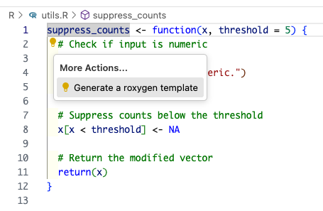
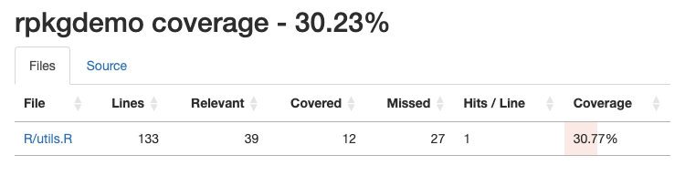
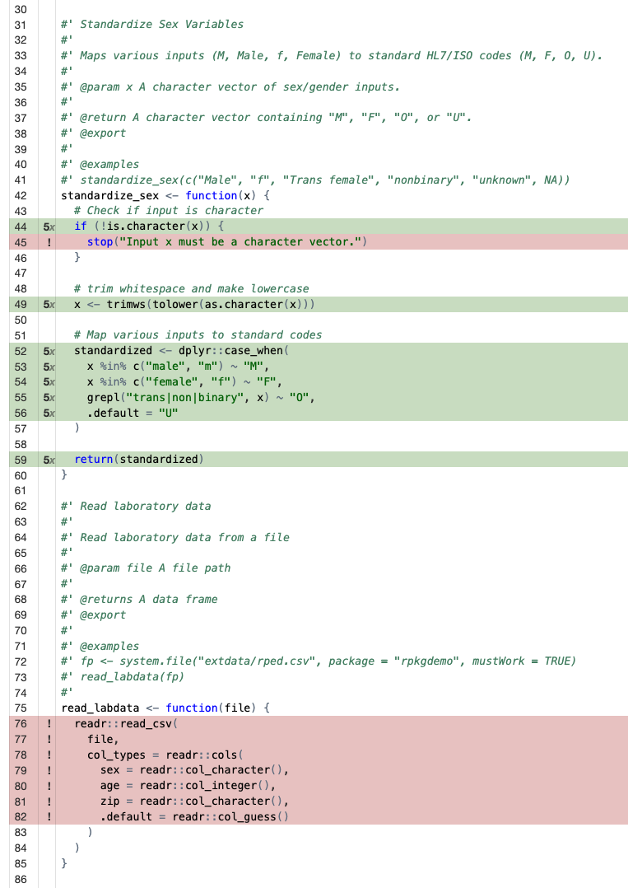
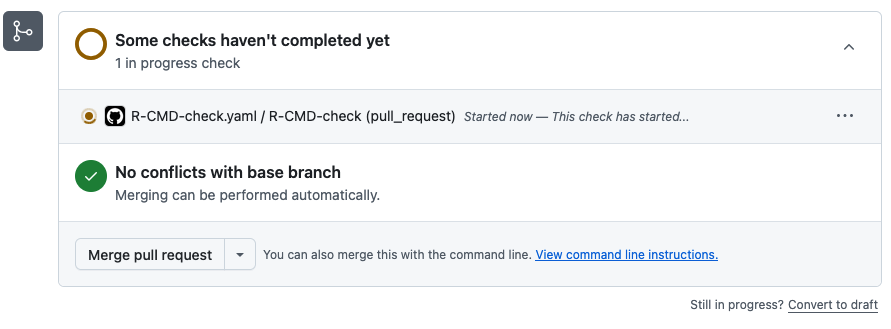

```{r, include = FALSE}
knitr::opts_chunk$set(
  collapse = TRUE,
  eval = FALSE,
  comment = "#>"
)
library(rpkgdemo)
library(dplyr)
```

# Setup TK

TK Positron

TK Air

TK RStudio keyboard bindings

TK git

To follow along the full tutorial you'll need the following packages installed:

```{r}
install.packages(c(
  "devtools",
  "usethis",
  "roxygen2",
  "testthat",
  "knitr",
  "rmarkdown",
  "pkgdown",
  "available",
  "dplyr",
  "janitor",
  "readxl",
  "stringr"
))
```

TK

```{r}
available::available("yourpackagename")
```

TK

Start a new directory.

Create a package.

```{r}
usethis::create_package(".")
```

Run `devtools::check()`, or cmd+shift+E, or command pallette cmd+shift+P "R: Check R Package".

```
W  checking DESCRIPTION meta-information ...
   Non-standard license specification:
     `use_mit_license()`, `use_gpl3_license()` or friends to pick a
     license
```


```{r}
usethis::use_mit_license()
```

Edit the `LICENSE` file to add your name.

Check again.

```
── R CMD check results ── rpkgdemo 0.0.0.9000 ──
Duration: 6.2s

0 errors ✔ | 0 warnings ✔ | 0 notes ✔
```

```sh
git init
git add .
git commit -m "Initial commit"
git remote add origin <your-repo-url>
git push -u origin main
```


# DESCRIPTION TK

Before:

```
Package: rpkgdemo
Title: What the Package Does (One Line, Title Case)
Version: 0.0.0.9000
Authors@R: 
    person("First", "Last", , "first.last@example.com", role = c("aut", "cre"))
Description: What the package does (one paragraph).
License: MIT + file LICENSE
Encoding: UTF-8
Roxygen: list(markdown = TRUE)
RoxygenNote: 7.3.3
```


```
Package: rpkgdemo
Title: A demo package for building R packages
Version: 0.0.0.9000
Authors@R: 
    person("Stephen", "Turner", , "first.last@example.com", role = c("aut", "cre"),
           comment = c(ORCID = "0000-0001-9140-9028"))
Description: A package to demonstrate building an R package to accompany a
    workshop on building R packages in Positron. See the getting started
    vignette for details.
License: MIT + file LICENSE
URL: https://github.com/stephenturner/rpkgdemo,
    https://stephenturner.github.io/rpkgdemo/
BugReports: https://github.com/stephenturner/rpkgdemo/issues
```


# Functions, part 1

TK: process diagram: write function, document, build, test, check, commit, push

## Our first function: no external dependencies

Let's add a simple function that doesn't use any external dependencies. This function will suppress data counts below a specified threshold by replacing them with `NA`. This might be required in some public health setting to protect privacy when reporting small counts.

All functions need to be in the `R/` directory of the package. These are regular `.R` files. You can organize your functions in any way you like within this directory. I like to group related functions together in the same file. Let's create a file called `utils.R` to hold our utility functions.

You could just create a new file manually, but I like to use the `usethis::use_r()` function, because it pairs well with `usethis::use_test()` that we'll discuss later. For example, to create a file named `utils.R`, you would run:

```{r}
usethis::use_r("utils")
```

Now let's add our function to this file.

```{r}
suppress_counts <- function(x, threshold = 5) {
  # Check if input is numeric
  if (!is.numeric(x)) {
    stop("Input x must be numeric.")
  }

  # Suppress counts below the threshold
  x[x < threshold] <- NA

  # Return the modified vector
  return(x)
}
```

We can try this function out in the console:

```{r, eval=TRUE, error=TRUE}
suppress_counts(c(1, 3, 5, 7, 9))
suppress_counts(c(10, 20, 3, 4, 5), threshold = 10)
suppress_counts(c("a", "b", "c"))
```

Now we need to document our function using special "roxygen comments" so that we can get help on our function with `?suppress_counts`. You can learn more about roxygen2 syntax [here](https://r-pkgs.org/man.html).

The easiest way to do this is with the Positron Code Action to generate a roxygen skeleton. Place your cursor on the function name and invoke the Code Action by clicking the 💡.



This will result in something that looks like this:

```{r}
#' Title
#'
#' @param x
#' @param threshold
#'
#' @returns
#'
#' @export
#' @examples
suppress_counts <- function(x, threshold = 5) {
  # Check if input is numeric
  if (!is.numeric(x)) {
    stop("Input x must be numeric.")
  }

  # Suppress counts below the threshold
  x[x < threshold] <- NA

  # Return the modified vector
  return(x)
}
```

Before we can use the function, we need to generate the documentation files. We can do this with the `devtools::document()` function, which processes the roxygen comments and creates the necessary files in the `man/` directory. You can also use the keyboard shortcut cmd+shift+D to run this command.

You'll see some errors:

```
✖ utils.R:3: @param requires two parts: an argument name and a description.
✖ utils.R:6: @returns requires a value.
✖ utils.R:9: @examples requires a value.
```

Let's go ahead and fill out our full documentation.

```{r}
#' Suppress Low Counts for Privacy
#'
#' Replaces numeric counts below a threshold with a suppression character ("NA").
#'
#' @param x A numeric vector of counts.
#' @param threshold Numeric. Values strictly less than this are suppressed. Default 5.
#'
#' @return A vector.
#' @export
#'
#' @examples
#' suppress_counts(c(1, 3, 5, 7, 9))
#' suppress_counts(c(10, 20, 3, 4, 5), threshold = 10)
#'
suppress_counts <- function(x, threshold = 5) {
  # Check if input is numeric
  if (!is.numeric(x)) {
    stop("Input x must be numeric.")
  }

  # Suppress counts below the threshold
  x[x < threshold] <- NA

  # Return the modified vector
  return(x)
}
```

Document and build the package again. Now try `?suppress_counts` to see the help file.


Go ahead and run a check (cmd+shift+E) to make sure everything is working so far.

```
── R CMD check results ── rpkgdemo 0.0.0.9000 ──
Duration: 8.7s

0 errors ✔ | 0 warnings ✔ | 0 notes ✔
```

## Adding additional arguments

Now let's add an additional argument to our function to allow users to specify a custom suppression value. R is smart enough to automatically change the type to character if we provide a character suppression symbol.

```{r}
#' Suppress Low Counts for Privacy
#'
#' Replaces numeric counts below a threshold with a suppression character (`NA`).
#'
#' @param x A numeric vector of counts.
#' @param threshold Numeric. Values strictly less than this are suppressed. Default 5.
#'
#' @return A vector.
#' @export
#'
#' @examples
#' suppress_counts(c(1, 3, 5, 7, 9))
#' suppress_counts(c(10, 20, 3, 4, 5), threshold = 10)
#' suppress_counts(1:10, threshold = 5, symbol = "*")
#'
suppress_counts <- function(x, threshold = 5, symbol = NA) {
  # Check if input is numeric
  if (!is.numeric(x)) {
    stop("Input x must be numeric.")
  }

  # Suppress counts below the threshold
  x[x < threshold] <- symbol

  # Return the modified vector
  return(x)
}
```

If you rebuild the package the function will work:

```{r}
suppress_counts(1:10, threshold = 5, symbol = "*")
```

But now run a check (cmd+shift+E) and you'll see a warning:

```
── R CMD check results ── rpkgdemo 0.0.0.9000 ──
Duration: 9.2s

❯ checking Rd \usage sections ... WARNING
  Undocumented arguments in Rd file 'suppress_counts.Rd'
    ‘symbol’
  
  Functions with \usage entries need to have the appropriate \alias
  entries, and all their arguments documented.
  The \usage entries must correspond to syntactically valid R code.
  See chapter ‘Writing R documentation files’ in the ‘Writing R
  Extensions’ manual.

0 errors ✔ | 1 warning ✖ | 0 notes ✔
Error: R CMD check found WARNINGs
Execution halted
```

So go back and add documentation for the new `symbol` argument.

```{r}
#' Suppress Low Counts for Privacy
#'
#' Replaces numeric counts below a threshold with a suppression character (`NA`).
#'
#' @param x A numeric vector of counts.
#' @param threshold Numeric. Values strictly less than this are suppressed. Default 5.
#' @param symbol Character or `NA`. The symbol to use for suppression. Default is `NA`.
#'
#' @return A vector.
#' @export
#'
#' @examples
#' suppress_counts(c(1, 3, 5, 7, 9))
#' suppress_counts(c(10, 20, 3, 4, 5), threshold = 10)
#' suppress_counts(1:10, threshold = 5, symbol = "*")
#'
suppress_counts <- function(x, threshold = 5, symbol = NA) {
  # Check if input is numeric
  if (!is.numeric(x)) {
    stop("Input x must be numeric.")
  }

  # Suppress counts below the threshold
  x[x < threshold] <- symbol

  # Return the modified vector
  return(x)
}
```

Everything should check out!

```
── R CMD check results ── rpkgdemo 0.0.0.9000 ──
Duration: 9.1s

0 errors ✔ | 0 warnings ✔ | 0 notes ✔
```

**Congratulations!** You've created your first function, documented it, and built your package!

Before we go on, take a look at what additional files were created when you documented your package. You'll never actually edit these by hand.

The `NAMESPACE` file:

```
# Generated by roxygen2: do not edit by hand

export(suppress_counts)
```

The `man/suppress_counts.Rd` file:

```
% Generated by roxygen2: do not edit by hand
% Please edit documentation in R/utils.R
\name{suppress_counts}
\alias{suppress_counts}
\title{Suppress Low Counts for Privacy}
\usage{
suppress_counts(x, threshold = 5, symbol = NA)
}
\arguments{
\item{x}{A numeric vector of counts.}

\item{threshold}{Numeric. Values strictly less than this are suppressed. Default 5.}

\item{symbol}{Character or \code{NA}. The symbol to use for suppression. Default is \code{NA}.}
}
\value{
A vector.
}
\description{
Replaces numeric counts below a threshold with a suppression character (\code{NA}).
}
\examples{
suppress_counts(c(1, 3, 5, 7, 9))
suppress_counts(c(10, 20, 3, 4, 5), threshold = 10)
suppress_counts(1:10, threshold = 5, symbol = "*")

}
```

Prior to Roxygen2, you would have had to create these files by hand!

## Our second function: with external dependencies

Let's add another function to map messy categorical inputs to standard codes (e.g., standardizing sex or gender entries). Here we're going to mape various inputs like "M", "female", etc. to standard FHIR (Fast Health Interoperability Resources) HL7 specs for healthcare interoperability. We'll be using [HL7 v2.3](https://hl7-definition.caristix.com/v2/HL7v2.3/Tables/0001) which allows for F (Female), M (Male), O (Other), U (Unknown).

Let's go ahead and stick this into `R/utils.R` as well.

Now, to use a function from another package we'll need to call the function using the `::` operator to avoid adding a dependency on the entire package. In this case, we'll use the `dplyr::case_when()` function from the `dplyr` package to map various inputs to standardized codes.

```{r}
#' Standardize Sex Variables
#'
#' Maps various inputs (M, Male, f, Female) to standard HL7/ISO codes (M, F, O, U).
#'
#' @param x A character vector of sex/gender inputs.
#'
#' @return A character vector containing "M", "F", "O", or "U".
#' @export
#'
#' @examples
#' standardize_sex(c("Male", "f", "Trans female", "nonbinary", "unknown", NA))
standardize_sex <- function(x) {
  # Check if input is character
  if (!is.character(x)) {
    stop("Input x must be a character vector.")
  }

  # trim whitespace and make lowercase
  x <- trimws(tolower(as.character(x)))

  # Map various inputs to standard codes
  standardized <- dplyr::case_when(
    x %in% c("male", "m") ~ "M",
    x %in% c("female", "f") ~ "F",
    grepl("trans|non|binary", x) ~ "O",
    .default = "U"
  )

  return(standardized)
}
```

Document and build the package again and try the function out.

```{r, eval=TRUE, error=TRUE}
standardize_sex(c("Male", "f", "Trans female", "nonbinary", "unknown", NA))
standardize_sex(c(1, 2, 1, 2))
```

But now run a check (cmd+shift+E) and you'll see an error:

```
── R CMD check results ── rpkgdemo 0.0.0.9000 ──
Duration: 9.2s

❯ checking dependencies in R code ... WARNING
  '::' or ':::' import not declared from: ‘dplyr’

0 errors ✔ | 1 warning ✖ | 0 notes ✔
Error: R CMD check found WARNINGs
Execution halted
```

This is because you're using a function from the `dplyr` package but haven't declared that your package depends on it. To fix this, you need to add `dplyr` to the `Imports` field in your `DESCRIPTION` file. The easiest way to do this is with the `usethis::use_package()` function:

```{r}
usethis::use_package("dplyr")
```

You'll see at the console:

```
✔ Adding dplyr to Imports field in DESCRIPTION.
☐ Refer to functions with `dplyr::fun()`.
```

And if you open up your `DESCRIPTION` file now, you'll see the imported dependency:

```
Imports: 
    dplyr
```

Now run a check (cmd+shift+E) again and everything should be good!

```
── R CMD check results ── rpkgdemo 0.0.0.9000 ──
Duration: 15.9s

0 errors ✔ | 0 warnings ✔ | 0 notes ✔
```

Take note that the package check took a few seconds longer, because R had to load the `dplyr` package to check your code. This brings up another point we won't cover today about packages with heavy dependencies. See the [pkgndep paper](https://pmc.ncbi.nlm.nih.gov/articles/PMC9438947/) and [pkgndep package](https://github.com/jokergoo/pkgndep) for details on analyzing dependency "heaviness."

# Package data

We'll come back and add more functions to the package soon, but let's take a quick detour to add some package data. There are a few different ways to include data in your package. 

1. Exported data. This is like the `iris` dataset that comes with R, or the `starwars` data that's available after you load dplyr. This data is stored in the `data/` directory of your package and is made available to users when they load your package.
2. Raw data. This is data that is stored in the `inst/extdata/` (installed / external data) directory of your package and can be read in by your functions as needed. This is useful for demonstrating functions for reading in data files.
3. Internal data. This is data that is used internally by your package functions but is not exported to the user.

We'll cover the first two in this tutorial.

## Exported data

As noted above, exported data is stored in the `data/` directory of your package. The data should be stored in `.rda` format, and must be documented. But the data in `data/` is usually a clean version of raw data you've gathered from elsewhere or created from code. And for the sake of reproducibility, it's best practice to include the code used to create the data in the `data-raw/` directory of your package.

The best way to do this is to call `usethis::use_data_raw()` which will create the `data-raw/` directory and a template script for creating your data, along with adding the `data-raw` directory to your `.Rbuildignore` file so that it doesn't get included when you build your package.

```{r}
usethis::use_data_raw()
```

That should create a file at `data-raw/DATASET.R`. You can name this file whatever you want. We're going to create two datasets: one that we download from the web and process/clean up a bit, and another that we create completely from code.

### External data from the web

Let's create a dataset that links ZIP code to city and state. You can get this data from the postal service at <https://postalpro.usps.com/ZIP_Locale_Detail>.

In your `data-raw/DATASET.R`, write and run the following code to download the excel file, read in tab #2, and do some cleanup before writing it out.

```{r}
# It's okay to load a package in this file - it's not part of the package itself
library(dplyr)

# Download the USPS ZIP code data
tf <- tempfile()
url <- "https://postalpro.usps.com/mnt/glusterfs/2025-12/ZIP_Locale_Detail.xls"
download.file(url = url, destfile = tf)

# Read in the data
zipcodes_raw <- readxl::read_excel(tf, sheet = "ZIP_DETAIL")
zipcodes_raw

# select relevant columns and clean up
zipcodes <-
  zipcodes_raw |>
  select(
    zip = `DELIVERY ZIPCODE`,
    city = `PHYSICAL CITY`,
    state = `PHYSICAL STATE`
  ) |>
  distinct(zip, .keep_all = TRUE) |>
  mutate(city = stringr::str_to_title(city)) |>
  arrange(zip, city)
zipcodes

# Save the dataset in the package
usethis::use_data(zipcodes, overwrite = TRUE)
```

You'll see a few notes:

```
> usethis::use_data(zipcodes, overwrite = TRUE)
✔ Adding R to Depends field in DESCRIPTION.
✔ Creating data/.
✔ Setting LazyData to "true" in DESCRIPTION.
✔ Saving "zipcodes" to "data/zipcodes.rda".
☐ Document your data (see <https://r-pkgs.org/data.html>).
```

Note that last line -- you need to document the data itself! If you don't believe me, run a check.

```
── R CMD check results ── rpkgdemo 0.0.0.9000 ──

Duration: 12.1s

❯ checking for missing documentation entries ... WARNING
  Undocumented code objects:
    ‘zipcodes’
  Undocumented data sets:
    ‘zipcodes’
  All user-level objects in a package should have documentation entries.
  See chapter ‘Writing R documentation files’ in the ‘Writing R
  Extensions’ manual.

0 errors ✔ | 1 warning ✖ | 0 notes ✔
Error: R CMD check found WARNINGs
Execution halted
```

Let's go ahead and document the data. We generally document all our package data in a `R/data.R` file. 

```{r}
usethis::use_r("data")
```

The data documentation looks a lot like function documentation. The only confusing things are (1) we never `@export` data, even though it's technically exported, and (2) we simply enter `"datasetname"` after the roxygen block to actually export the data. It should look like this:

```{r}
#' ZIP code data
#'
#' ZIP code data from the US Postal Service.
#'
#' @format A data frame with three columns
#' 1. `zip`: The ZIP code.
#' 2. `city`: The U.S. city for that zip code.
#' 3. `state`: The U.S. state for that zip code.
#'
#' @source <https://postalpro.usps.com/ZIP_Locale_Detail>
#'
#' @examples
#' zipcodes
#'
"zipcodes"
```

Document (cmd+shift+d), rebuild (cmd+shift+b), check (cmd+shift+e) again and everything should be good! Try running `?zipcodes` to see the help file for the dataset.

### Creating data from code

In that same `data-raw/DATASET.R` file, let's create a synthetic dataset that we can use to demonstrate our functions. 

```{r}
# Create some sex variables to sample from
sexes <- c(
  "male",
  "female",
  "Male",
  "Female",
  "M",
  "F",
  "m",
  "f",
  "transgender",
  "trans male",
  "Trans Female",
  "non-binary",
  "Unknown",
  "unk",
  "???"
)
sexes

# Get only virginia zip codes
vazips <-
  zipcodes |>
  dplyr::filter(state == "VA") |>
  dplyr::pull(zip)
vazips

# Create a 1000 row dataset. Make sure to set a random seed!
n <- 1000
set.seed(20251205)
rped <-
  tibble::tibble(
    sex = sample(sexes, size = n, replace = TRUE),
    age = sample(20L:60L, size = n, replace = TRUE),
    zip = sample(vazips, size = n, replace = TRUE),
    lab1 = rpois(n, lambda = 2),
    lab2 = rpois(n, lambda = 10)
  ) |>
  arrange(zip) |>
  mutate(id = row_number(), .before = 1)
# Add some noise
rped$zip[1] <- "12345"
rped$age[2] <- 12
rped$age[3] <- 120
rped

# Save the dataset in the package
usethis::use_data(rped, overwrite = TRUE)
```

Go ahead and open up `R/data.R` again and add documentation for this dataset as well. Don't close this file, we'll come back to it momentarily.

```{r}
#' RPED: R Package Example Data
#'
#' Simulated data for demonstrating the functionality of the rpkgdemo package.
#'
#' @format A data frame with 6 columns:
#' 1. `id`: A unique identifier for each individual.
#' 2. `sex`: The sex of the individual.
#' 3. `age`: The age of the individual.
#' 4. `zip`: The ZIP code of the individual's residence.
#' 5. `lab1`: A simulated lab value from a Poisson distribution with lambda=2.
#' 6. `lab2`: A simulated lab value from a Poisson distribution with lambda=10.
#'
#' @examples
#' rped
#'
"rped"
```

And run a document, build, check once more.

## Raw data

In a few minutes we're going to write a function to read in data like this from a CSV file that sets a few options not in the `readr::read_csv()` defaults. Above we created some example data we can work with by just running `rped`, but to write examples (and later tests) with a function to read in files, we actually need data stored in a file that we can access from our function. 

Go back into your `data-raw/DATASET.R` file and add this to the very end of the data generation script you have.

If you've never used `here::here()` before, it's a great way to create file paths relative to the root of your project, regardless of your working directory. It looks for a `.git` directory or a `DESCRIPTION` file.  Try it.

```{r}
# Write as installed data
extdatadir <- here::here("inst/extdata")
extdatadir
dir.create(extdatadir, recursive = TRUE)
readr::write_csv(rped, here::here("inst/extdata/rped.csv"))
```

Rebuild the package, and try running this code below. This will retrieve the absolute path to this installed raw data _on your system_. It'll look different than what you see below for me.

```{r, eval=TRUE}
system.file("extdata/rped.csv", package = "rpkgdemo")
```

# Functions, part 2

Now that we have some built-in package data (exported and raw files), let's add a few more functions.

## Read in raw data

First, let's write a function to read data like we created above from a file. Sure, you could just use `readr::read_csv()`. But imagine you've got some data from zip codes 02108 (Boston, MA) or 00901 (San Juan, PR)? These zip codes have leading zeros that get stripped when read in as numeric. So let's create a function that always reads in zip codes as character, sex as character, and age as integer. If you try to read in some other data with this function, it'll throw warnings and/or errors.

Back in `R/utils.R`, add this function, fully documented, with examples. Note you have to prefix _all_ the readr functions with `readr::`.

```{r}
#' Read laboratory data
#'
#' Read laboratory data from a file
#'
#' @param file A file path
#'
#' @returns A data frame
#' @export
#'
#' @examples
#' fp <- system.file("extdata/rped.csv", package = "rpkgdemo", mustWork = TRUE)
#' read_labdata(fp)
#'
read_labdata <- function(file) {
  readr::read_csv(
    file,
    col_types = readr::cols(
      sex = readr::col_character(),
      age = readr::col_integer(),
      zip = readr::col_character(),
      .default = readr::col_guess()
    )
  )
}
```

Note here that the example uses `system.file()` to get the path to the installed raw data file we created earlier. Document, build, check.

Oops -- we have a warning. We forgot to import the `readr` package!

```{r}
── R CMD check results ── rpkgdemo 0.0.0.9000 ──
Duration: 13.7s

❯ checking dependencies in R code ... WARNING
  '::' or ':::' import not declared from: ‘readr’

0 errors ✔ | 1 warning ✖ | 0 notes ✔
Error: R CMD check found WARNINGs
Execution halted
```

Add it to the `Imports` in `DESCRIPTION` with usethis:

```{r}
usethis::use_package("readr")
```

Check once again and it should be clean.

## Using dplyr data masking in packages

Let's add another function that uses piped dplyr code with data masking. Here's the full function with roxygen documentation. This standardizes the `sex` variable using our earlier function, joins with the `zipcodes` data, and centers and scales lab values.

```{r}
#' Prepare lab data
#'
#' Prepare lab data for analysis. Standardizes the `sex` variable, joins with `zipcodes` data, centers and scales lab values.
#'
#' @param x A data frame containing lab data with at least `sex`, `zip`, and lab value columns starting with "lab".
#'
#' @returns A data frame with standardized `sex`, joined `zipcodes`, and scaled lab values.
#' @export
#' 
#' @examples
#' prep_lab_data(rped)
#' 
prep_lab_data <- function(x) {
  x |>
    dplyr::mutate(sex = standardize_sex(sex)) |>
    dplyr::left_join(zipcodes, by = "zip") |>
    dplyr::mutate(dplyr::across(dplyr::starts_with("lab"), \(x) scale(x)[, 1]))
}
```

Write this function, document, and build the package, and the function will work. But what happens when we check the package? We get some weird `NOTE`s. 

```
── R CMD check results ── rpkgdemo 0.0.0.9000 ──
Duration: 12.7s

❯ checking R code for possible problems ... NOTE
  prep_lab_data: no visible binding for global variable ‘sex’
  prep_lab_data: no visible binding for global variable ‘zipcodes’
  Undefined global functions or variables:
    sex zipcodes

0 errors ✔ | 0 warnings ✔ | 1 note ✖
```

This is because of how dplyr does data masking with the pipe operator (`|>`). R CMD check can't see where `sex` or `zipcodes` are coming from, so it throws a NOTE. You can see lots of solutions to this problem by Googling or asking Chat how to fix the "no visible binding for global variable" problem. Some of them involve declaring global variables. But the best practice is described in the [Using dplyr in packages vignette](https://dplyr.tidyverse.org/articles/in-packages.html). The best way to do this is with the ["`.data` pronoun" from rlang](https://rlang.r-lib.org/reference/dot-data.html). We'll have to put `.data$` in front of `sex`. We'll also need to explicitly reference the `zipcodes` data from the package we're building with `rpkgdemo::zipcodes`.

You can do this now, but you'll get another note saying that you have an undefined global function/variable called `.data`. The way to fix this is to import `.data` from `rlang` with usethis. You only have to do this once. You'll get a note about package-level documentation. Go ahead and accept. Document, rebuild, check.

```{r}
usethis::use_import_from("rlang", ".data")
```

Finally, let's add some sanity checking to our function to throw some warnings if we have ZIP codes that aren't real, ages that are out of range, or minors in the dataset. Notice that I'm adding an option for whether these warnings are issued or not. We'll examine this when we get to testing below. Here's the final function:

```{r}
#' Prepare lab data
#'
#' Prepare lab data for analysis. Standardizes the `sex` variable, joins with `zipcodes` data, centers and scales lab values.
#'
#' @param x A data frame containing lab data with at least `sex`, `zip`, and lab value columns starting with "lab".
#' @param warnings Logical. Whether to issue warnings for potential data issues (bad zip codes, minors, unrealistic ages). Default is `TRUE`.
#'
#' @returns A data frame with standardized `sex`, joined `zipcodes`, and scaled lab values.
#' @export
#'
#' @examples
#' prep_lab_data(rped)
#'
prep_lab_data <- function(x, warnings = TRUE) {
  # Check for potential issues
  if (warnings) {
    # Check for bad zip codes
    badzips <- !(x$zip %in% rpkgdemo::zipcodes$zip)
    if (any(badzips)) {
      warning(paste0("Found ", sum(badzips), " bad zip code(s)."))
    }

    # Check for minors
    minors <- x$age < 18
    if (any(minors)) {
      warning(paste0("Found ", sum(minors), " minor(s) in dataset."))
    }

    # Check for unrealistic numbers
    unrealistic <- x$age < 0 | x$age > 120
    if (any(unrealistic)) {
      warning(paste0(
        "Found ",
        sum(unrealistic),
        " unrealistic age(s) in dataset."
      ))
    }
  }

  # Prepare the data
  result <-
    x |>
    dplyr::mutate(sex = standardize_sex(.data$sex)) |>
    dplyr::left_join(rpkgdemo::zipcodes, by = "zip") |>
    dplyr::mutate(dplyr::across(dplyr::starts_with("lab"), \(x) scale(x)[, 1]))
  return(result)
}
```

# Tests

Testing is an essential part of building a robust R package. It helps ensure that your functions work as expected and can catch bugs early in the development process. We'll use the `testthat` package, which is the most popular testing framework in the R community.

You can read more about testing in [Testing chapter of the R Packages book](https://r-pkgs.org/testing-basics.html) and in the [testthat documentation](https://testthat.r-lib.org/).

## Setting up testthat

As always, we'll use `usethis` to set up our testing infrastructure. Just as we used `usethis::use_r("utils")` to create `R/utils.R`, we'll use a similar pattern here to create the initial testthat infrastructure, and a test file for our `utils.R` functions.

```{r}
usethis::use_test("utils")
```

```
✔ Adding testthat to Suggests field in DESCRIPTION.
✔ Adding "3" to Config/testthat/edition.
✔ Creating tests/testthat/.
✔ Writing tests/testthat.R.
✔ Writing tests/testthat/test-utils.R.
☐ Modify tests/testthat/test-utils.R.
```

Go ahead and play around with the boilerplate multiplication test already set up. Then you can run the package tests with `devtools::test()` or with the keyboard shortcut cmd+shift+T.

## Our first real tests

At this point you want to open up utils.R and test-utils.R side by side and start writing tests that will cover every component of the code.

Let's go through in detail what I'm doing here. Notice that I'm first creating a result object `res` that holds the result of running the function. I'm wrapping that whole assignment in an `expect_silent()`, which would fail if the function throws a warning. Then I'm using `expect_*()` functions to check that the result is what I expect. Finally, I'm also testing that the function throws an error when given incorrect input, which it should. If the function doesn't throw an error when it should, the test will fail.

```{r}
test_that("suppress_counts", {
  # Correct usage
  expect_silent(res <- suppress_counts(c(1, 3, 5, 7, 9)))
  expect_equal(res, c(NA, NA, 5, 7, 9))
  expect_silent(res <- suppress_counts(c(10, 20, 3, 4, 5), threshold = 10))
  expect_true(all(is.na(res[3:5])))
  expect_silent(res <- suppress_counts(1:10, threshold = 5, symbol = "*"))
  expect_true(all(res[1:4] == "*"))
  # Incorrect usage
  expect_error(suppress_counts("not numeric"))
})
```

## Coverage with covr

Testing all possible use cases of your functions can be tedious. The `covr` package can help you identify which lines of code are covered by your tests and which are not. 

You can get a high-level summary of test coverage with:

```{r}
covr::package_coverage()
```

```
> covr::package_coverage()
rpkgdemo Coverage: 9.30%
R/utils.R: 9.30%
```

This is telling us we have terrible coverage. Let's keep adding tests to that file:

```{r}
test_that("standardize_sex", {
  result <- standardize_sex(c("Male", "male", "M", "m"))
  expect_equal(result, c("M", "M", "M", "M"))
  result <- standardize_sex(c("Female", "female", "F", "f"))
  expect_equal(result, c("F", "F", "F", "F"))
  result <- standardize_sex(c(
    "Trans female",
    "transgender",
    "nonbinary",
    "non-binary"
  ))
  expect_equal(result, c("O", "O", "O", "O"))
  result <- standardize_sex(c("unknown", "xyz", ""))
  expect_equal(result, c("U", "U", "U"))
  result <- standardize_sex(c("  Male  ", "  female  "))
  expect_equal(result, c("M", "F"))
})
```

This time, instead of running `covr::package_coverage()`, let's use the `covr::report()` function which will generate an HTML report that you can view in your web browser. This report will show you which lines of code are covered by your tests and which are not.

```{r}
covr::report()
```



If you click on the particular source code file, you can see where you have coverage and where you don't. It's clear from our coverage report that we didn't test the error handling in the `standardize_sex()` function, and we didn't test the remaining functions at all.



We can continue writing tests until we have 100% coverage, but in real life that's not always feasible. Aim for high coverage, but focus on testing the most important parts of your code. Pro-tip: nearly any Frontier AI model can automate all the tedious parts of writing tests for you. I've had good success with [Positron Assistant](https://blog.stephenturner.us/p/positron-assistant-copilot-chat-agent).

```{r}
covr::package_coverage()
```

```
rpkgdemo Coverage: 100.00%
R/utils.R: 100.00%
```

```{r}
devtools::test()
```

```
ℹ Testing rpkgdemo
✔ | F W  S  OK | Context
✔ |         25 | utils                                                                                                                                                                

══ Results ═════════════════==========
[ FAIL 0 | WARN 0 | SKIP 0 | PASS 25 ]
```

Make sure to document, build, and check one last time to ensure everything is working. Notice now when you run a `devtools::check()` it automatically runs all the tests in the package!

# README.Rmd

```{r}
usethis::use_readme_rmd()
devtools::build_readme()
```


# GitHub Actions TK

```{r}
usethis::use_github_action("check-release")
```

```
✔ Setting active project to "/Users/sdt5z/repos/rpkgdemo".
✔ Creating .github/.
✔ Adding "^\\.github$" to .Rbuildignore.
✔ Adding "*.html" to .github/.gitignore.
✔ Creating .github/workflows/.
✔ Saving "r-lib/actions/examples/check-release.yaml@v2" to .github/workflows/R-CMD-check.yaml.
☐ Learn more at <https://github.com/r-lib/actions/blob/v2/examples/README.md>.
✔ Adding "R-CMD-check badge" to README.Rmd.
☐ Re-knit README.Rmd with devtools::build_readme().
> devtools::build_readme()
ℹ Installing rpkgdemo in temporary library
ℹ Building /Users/sdt5z/repos/rpkgdemo/README.Rmd
```

```{r}
devtools::build_readme()
```





# pkgdown


```{r}
usethis::use_pkgdown()
```

```{r}
devtools::build_readme()
```

```{r}
pkgdown::build_site()
```

```{r}
usethis::use_pkgdown_github_pages()
```

```
✔ Writing _pkgdown.yml.
☐ Modify _pkgdown.yml.
✔ Initializing empty, orphan branch "gh-pages" in GitHub repo "stephenturner/rpkgdemo".
✔ GitHub Pages is publishing from:
• URL: "https://stephenturner.github.io/rpkgdemo/"
• Branch: "gh-pages"
• Path: "/"
✔ Saving "r-lib/actions/examples/pkgdown.yaml@v2" to .github/workflows/pkgdown.yaml.
☐ Learn more at <https://github.com/r-lib/actions/blob/v2/examples/README.md>.
✔ Recording <https://stephenturner.github.io/rpkgdemo/> as site's url in _pkgdown.yml.
☐ Run devtools::document() to update package-level documentation.
✔ Setting <https://stephenturner.github.io/rpkgdemo/> as homepage of GitHub repo "stephenturner/rpkgdemo".
```


# Vignettes


# Other topics

## R Universe

## CRAN submission

## Docker & pracpac

# Additional resources

- [R Packages book](https://r-pkgs.org/)
- [Happy Git and GitHub for the useR](https://happygitwithr.com/)
- [R for Data Science book](https://r4ds.had.co.nz/)
